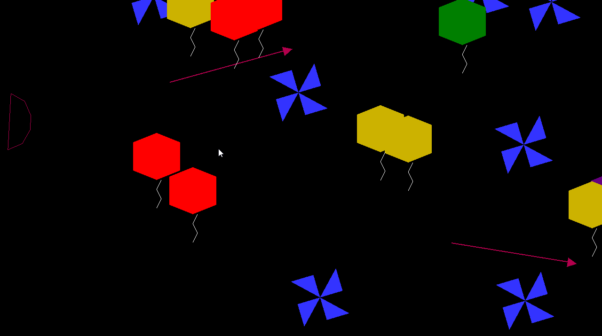
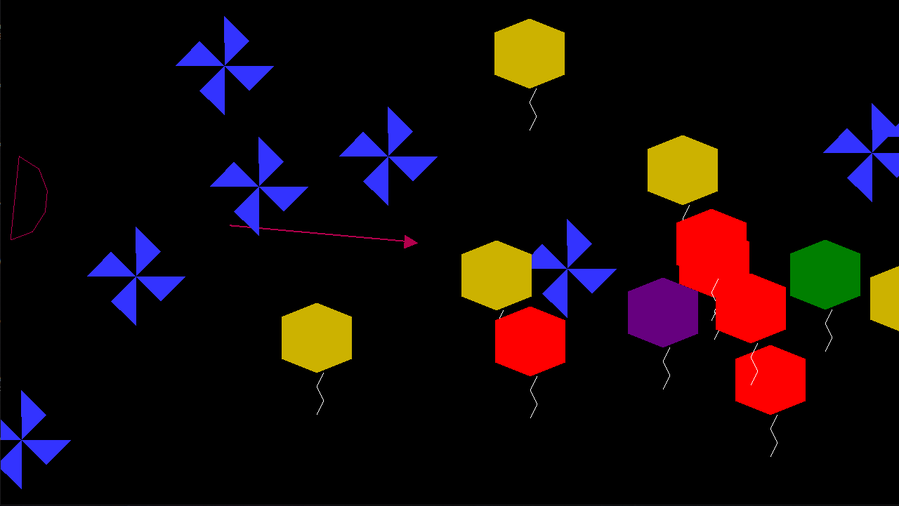

# Bow and arrow-like 2D game

### Description

A bow and arrow-style 2D game

Tech stack:
 * C++
 * OpenGL
 * EGC Framework

### Features

* 4 types of balloons with different effects
* Shurikens attacking from the right side
* Multiple arrows
* Power bar which alters arrow speed

### Download

Download zip file from the [Releases section](https://github.com/alexandra-luca/egc-tema1/releases/tag/v2.0)
